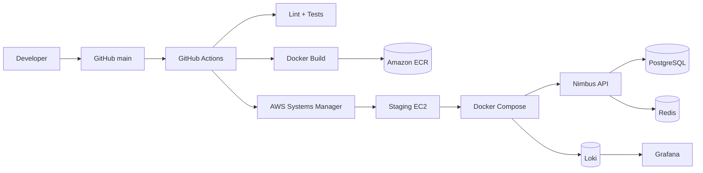

# Nimbus — DevOps End-to-End Project

Nimbus demonstrates a production-ready path from source code to a reproducible staging deployment.

## Architecture



## Stack

- FastAPI application
- PostgreSQL database
- Redis cache
- Docker Compose for local/staging runtime
- Terraform for AWS infrastructure
- GitHub Actions for CI/CD
- Amazon ECR for images
- AWS Systems Manager (SSM) for deployment; no SSH key required
- Loki + Grafana for lightweight aggregated application logs

## Assumptions and trade-offs

1. Staging is a single EC2 instance to keep the take-home project inside the $0–5 target where free-tier eligibility applies.
2. PostgreSQL and Redis run as containers on the staging host. A production SaaS deployment should normally move PostgreSQL to a managed database such as RDS.
3. The application is intentionally small; the operational design is the focus.
4. The starter repository referenced by the assignment was not supplied with this submission, so Nimbus contains a representative API implementation rather than modifying an unseen starter application.
5. No Kubernetes is used because the assignment explicitly says it is optional.
6. Secrets are generated on the staging host and are never stored in Terraform variables, Git, Dockerfiles, or image layers.
7. AWS credentials are obtained by GitHub Actions through OIDC. The workflow does not store a long-lived AWS access key.
8. The pipeline deploys an immutable image tag based on the Git commit SHA.

## Prerequisites

Local:
- Docker Desktop / Docker Engine + Compose v2
- Git

AWS deployment:
- AWS account with free-tier eligibility where applicable
- Terraform >= 1.6
- GitHub repository with Actions enabled
- GitHub Actions OIDC configured through the Terraform-created IAM role

## Local run

```bash
cp .env.example .env
docker compose up --build
```

Then:

```bash
curl http://localhost:8000/health
curl http://localhost:8000/api/v1/items
```

The API exposes:
- `GET /health`
- `GET /ready`
- `GET /api/v1/items`
- `POST /api/v1/items`

Grafana is available at `http://localhost:3000`.
Loki is available at `http://localhost:3100`.

Default local Grafana credentials are `admin` / `admin` only for local development. Do not reuse them in production.

Stop:

```bash
docker compose down
```

Remove local volumes too:

```bash
docker compose down -v
```

## Repository layout

```text
.
├── app/
│   ├── main.py
│   ├── db.py
│   ├── cache.py
│   └── models.py
├── tests/
├── infra/
│   ├── main.tf
│   ├── variables.tf
│   ├── outputs.tf
│   ├── iam.tf
│   └── user_data.sh.tftpl
├── monitoring/
│   ├── loki-config.yml
│   ├── promtail-config.yml
│   └── grafana-datasources.yml
├── scripts/
│   ├── deploy.sh
│   ├── rollback.sh
│   └── remote-bootstrap.sh
├── .github/workflows/
│   └── deploy.yml
├── Dockerfile
├── docker-compose.yml
├── requirements.txt
├── requirements-dev.txt
├── pyproject.toml
├── .env.example
├── ROLLBACK.md
├── NOTES.md
└── SECURITY.md
```

## AWS infrastructure

From `infra/`:

```bash
terraform init
terraform fmt -check
terraform validate
terraform plan
terraform apply
```

Destroy:

```bash
terraform destroy
```

The Terraform configuration creates:
- VPC
- public subnet
- internet gateway and route table
- security group
- ECR repository
- EC2 staging host
- IAM instance role for SSM and ECR pulls
- IAM deployment role for GitHub OIDC
- SSM association for Docker installation/bootstrap

The EC2 host is deliberately simple. The database is a PostgreSQL container because the assignment prioritizes cost-awareness. For a real production environment, use a private subnet and managed PostgreSQL.

## GitHub configuration

After Terraform apply, note:

```bash
terraform output github_actions_role_arn
terraform output ecr_repository_url
terraform output instance_id
```

In GitHub repository settings, create the following repository variables:

- `AWS_DEPLOY_ROLE_ARN` = value of `github_actions_role_arn`
- `AWS_REGION` = your selected region, e.g. `us-east-1`

No AWS secret key is required.

The workflow:
1. Checks out the commit.
2. Installs Python dependencies.
3. Runs Ruff lint.
4. Runs pytest.
5. Configures AWS credentials through GitHub OIDC.
6. Logs in to ECR.
7. Builds the Docker image.
8. Tags it with the Git SHA and `staging`.
9. Pushes the immutable SHA tag to ECR.
10. Sends an SSM command to the staging host.
11. Pulls the SHA image.
12. Starts the application and waits for `/health`.
13. On failure, the deployment script restores the previous image tag.

## Important GitHub OIDC trust setting

Terraform needs the GitHub repository owner/name because the IAM trust policy restricts deployment to this repository:

```text
github_repository = "OWNER/REPOSITORY"
```

Set it before:

```bash
terraform apply -var='github_repository=OWNER/REPOSITORY'
```

## Manual deployment

If the image already exists in ECR:

```bash
./scripts/deploy.sh <image-tag>
```

The script is mainly a reference for the SSM command used by CI.

## Rollback

See `ROLLBACK.md`.

Application rollback is safe when the database schema remains backward-compatible:

```bash
./scripts/rollback.sh <previous-sha>
```

A data migration rollback is different. Never assume that restoring an application image can undo a destructive database migration. Use backward-compatible expand/contract migrations, backups, and an explicit recovery procedure.

## Observability

Health:
- Docker healthcheck
- `/health` for process-level health
- `/ready` verifies PostgreSQL and Redis connectivity

Logs:
- application logs go to stdout
- Docker forwards logs to Promtail
- Promtail sends logs to Loki
- Grafana queries Loki

Useful checks:

```bash
docker compose ps
docker compose logs --tail=100 api
docker compose logs --tail=100 promtail
```

## CI failure handling

Tests are a hard gate. An image is not pushed and staging is not changed if lint/test fails.

A deployment failure triggers a remote rollback to the previous known-good image when one exists. The workflow still fails so the team can investigate.

## Definition of Done mapping

| Requirement | Implementation |
|---|---|
| Containerization | Multi-stage Dockerfile, non-root user, Compose |
| IaC | Terraform under `infra/` |
| CI/CD | `.github/workflows/deploy.yml` |
| Secrets | OIDC + host-generated DB secret |
| Healthchecks | Compose healthchecks + API endpoints |
| Aggregated logs | Promtail + Loki + Grafana |
| Rollback | Immutable SHA tags + rollback script |
| Runbook | README + ROLLBACK.md |
| Limitations | NOTES.md |

## Walkthrough talking points

### Git push to production-like staging

`git push` → GitHub Actions → lint/tests → Docker build → ECR → SSM → EC2 pulls immutable image → Compose restarts API → healthcheck → deployment succeeds.

### What breaks first at 10x traffic?

The single EC2 host and PostgreSQL container are the first likely bottlenecks. I would move PostgreSQL to RDS, put the API behind an ALB, run multiple tasks/instances, add autoscaling, and introduce Redis metrics and database connection-pool limits.

### Where did we cut corners?

We avoided Kubernetes, managed observability, ALB, RDS, and multi-AZ infrastructure because the assignment has a 4–6 hour time box and a $0–5 target. These are intentional staging trade-offs, not production recommendations.
